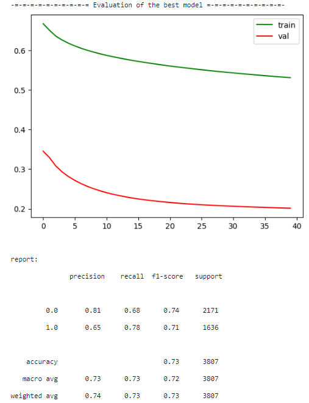

# Поиск лучшей модели

### Bert-base-uncased(gradiens=false)+fc+sigmoid

class NerualNet(nn.Module):
    def __init__(self, hidden_size=768, num_class=1):
        super(NerualNet, self).__init__()

        self.bert = BertModel.from_pretrained('bert-base-uncased')
        for param in self.bert.parameters():
                param.requires_grad = False
        self.fc = nn.Linear(hidden_size, num_class)
        self.sigm = nn.Sigmoid()
        
    def forward(self,input_ids,input_mask,segment_ids):
        bert_output = self.bert(input_ids, token_type_ids=segment_ids, attention_mask=input_mask)
        output = self.fc(bert_output[1].squeeze())
        y_pred = self.sigm(output).squeeze()
        return y_pred

