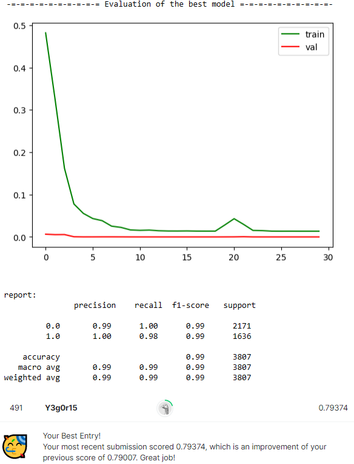

# Поиск лучшей модели

### 1. bert-base-uncased(gradiens=false)+fc+sigmoid

    class NerualNet(nn.Module):
        def __init__(self, hidden_size=768, num_class=1):
            super(NerualNet, self).__init__()

            self.bert = BertModel.from_pretrained('bert-base-uncased')
            for param in self.bert.parameters():
                    param.requires_grad = False
            self.fc = nn.Linear(hidden_size, num_class)
            self.sigm = nn.Sigmoid()
            
        def forward(self,input_ids,input_mask,segment_ids):
            bert_output = self.bert(input_ids, token_type_ids=segment_ids, attention_mask=input_mask)
            output = self.fc(bert_output[1].squeeze())
            y_pred = self.sigm(output).squeeze()
            return y_pred

  

### 2. bert-base-uncased(gradiens of first 10l=false and 11l=true)+multisample+fc+sigmoid

    class NerualNet(nn.Module):
        def __init__(self, hidden_size=768, num_class=2):
            super(NerualNet, self).__init__()

        self.bert = BertModel.from_pretrained('bert-base-uncased')
        for layer in self.bert.encoder.layer[:11]:
            for param in layer.parameters():
                    param.requires_grad = False
        self.dropouts = nn.ModuleList([
            nn.Dropout(0.5) for _ in range(5)
        ])
        self.fc = nn.Linear(hidden_size, num_class)
        self.sigm = nn.Sigmoid()
        
    def forward(self,input_ids,input_mask,segment_ids):
        bert_output = self.bert(input_ids, token_type_ids=segment_ids, attention_mask=input_mask)
        for i, dropout in enumerate(self.dropouts):
            if i == 0:
                h = self.fc(dropout(bert_output[1].squeeze()))
            else:
                h += self.fc(dropout(bert_output[1].squeeze()))
        return h / len(self.dropouts)

